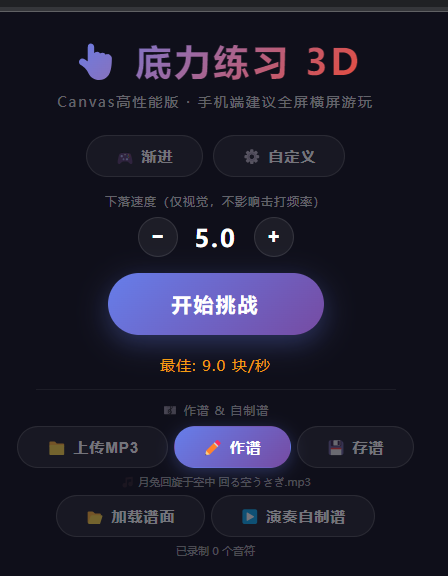
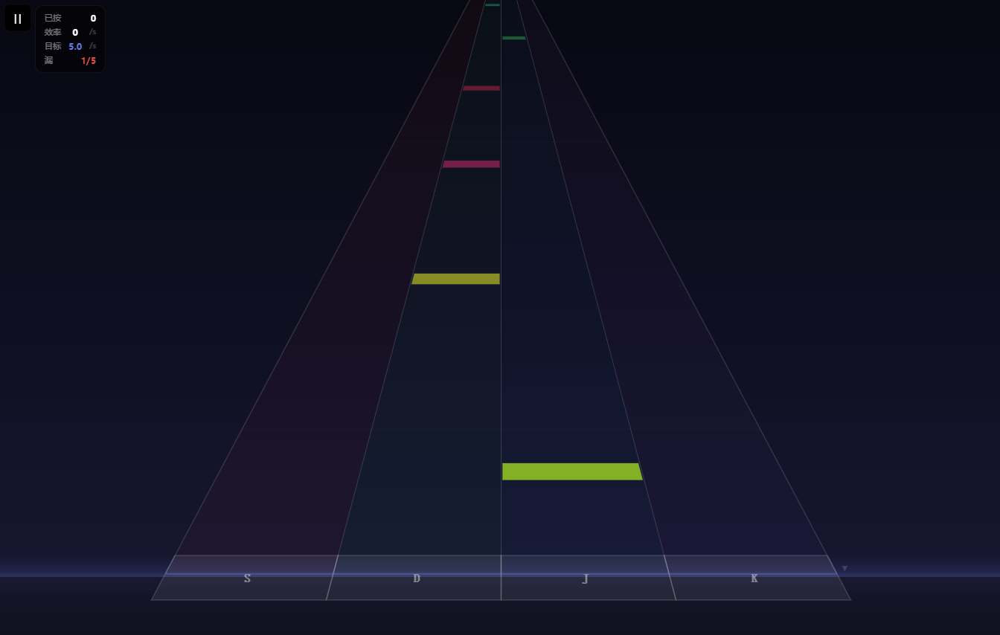
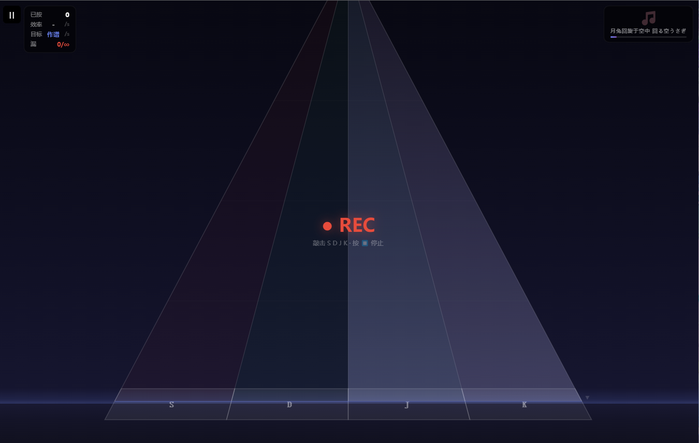
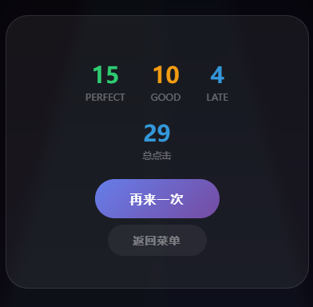

# 音游模拟器

纯前端节奏游戏模拟器，支持**渐进式底力练习**和**自制谱演奏**。单个 HTML 文件，Canvas 高性能渲染，手机/桌面均可游玩。

## 截图

> 待补充

| 菜单 | 游戏中 |
|------|--------|
|  |  |

| 自制谱录制 | 游玩结算 |
|------------|------|
|  |  |

## 功能

- **渐进模式** — 每 5 秒加速 0.2 块/秒，挑战极限手速
- **自定义模式** — 自由设定每秒方块数或 BPM
- **自制谱** — 上传 MP3，跟随音乐敲击录制谱面，保存/加载 JSON 谱面
- **谱面演奏** — 加载谱面 + MP3，自动下落演奏
- **Canvas 渲染** — 3D 透视跑道，移动端高刷屏流畅运行
- **移动端适配** — 响应式布局，触屏 S/D/J/K 四键分区敲击
- **成绩追踪** — localStorage 保存最佳记录

## 操作

| 键位 | 通道 |
|------|------|
| S / 左侧触屏 | 左 1 |
| D / 左中触屏 | 左 2 |
| J / 右中触屏 | 右 3 |
| K / 右侧触屏 | 右 4 |
| Esc / P | 暂停 |

## 技术

- 3D 透视投影数学模型
- Canvas 离屏缓存 + 分层合成
- 帧率无关的时间基物理（dt-based movement）
- Web Audio API 节拍器
- `jsmediatags` 读取 MP3 封面
- 自制谱 JSON 导入导出

## 本地运行

直接在浏览器打开 `音游模拟器.html`。无构建工具，无依赖（除 CDN 的 jsmediatags 用于读取歌曲封面）。
